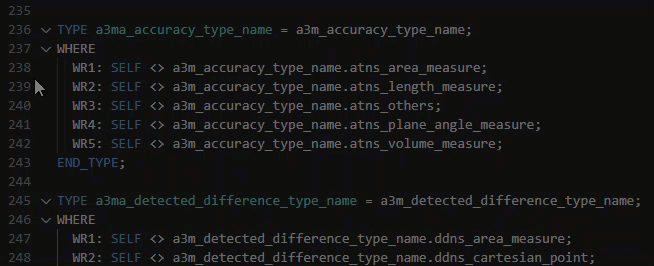
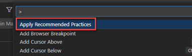
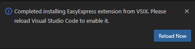

# easyEXPRESS
Language support for EXPRESS schema development
<!-- Document contents based on a template from  https://github.com/usnistgov/opensource-repo#readme -->

<!-- This document is available free of charge from [link](https://doi.org]<!-- URL -->

# Introduction
The easyEXPRESS extension was developed to provide language support for [EXPRESS](https://www.expresslang.org/) language files. It was initially targeted for improved development of [ISO 10303-11](https://www.iso.org/standard/38047.html) for [ISO 10303-21](https://www.iso.org/standard/63141.html) STEP development, but can be used with any EXPRESS schema.

- Authoring and validation of the EXPRESS files are based on schema rules, eliminating the need to rely on a users understanding of the complex file format, which is error-prone.

- Autocomplete Typing repetitive information is time-consuming and error-prone. This allows more time for use of cognative skills to carry out more complex tasks.

- Navigating the schema to locate inherited references across multiple schemas in the workspace is prone to error if all files are not checked

- Large entities are hard to decipher visually.

With the easyEXPRESS extension, authoring time is reduced by presenting lists of repetitive commands for use with code completion and dropdown lists containing only valid values based on type from parsing files in the active workspace. Warnings and error messages with recommended solutions are provided to ensure syntax and content accuracy. 

<!-- FUNCTIONALITY -->
# Functionality
A list of functions and how they operate is listed in alphabetical order below.

## Code Completion
Snippets based on the syntax of the lexical elements and grammar found in Annex A of [ISO 10303-11](https://www.iso.org/standard/38047.html) assist in efficient authoring by presenting only valid options based on rules for valid content.

The list of items with autocompletion is based on the hierarchy of the item being defined.

<!-- ## Enumeration Type
- Not implemented yet -->

## Errors and Warnings
If the lexical elements or grammar rules are not followed, the user is presented with a warning or error message that contains a hover over suggested fix.

Elements that are underlined with a red squiggly line indicate an error in the content.

## Folding
Regions of code can be collapsed using the folding functionality.
- To collapse a region, move the mouse to the gutter area next to the start line of the region to fold and click the `>` <!-- or is it the single dash? --> icon.
- To unfold a region, click the `v` <!-- &#8897; &#8964; --> icon.
- There are numerous other ways to fold code explained [here](https://code.visualstudio.com/docs/editor/codebasics#_folding)

## Inlay Hints
Inlay hints of types and attributes are presented when defining entities based on schemas loaded in the workspace.

## Outline of Document
An outline of the document can be viewed in the explorer pane and can be sorted based on type, name, category, and position in the file. Categories of elements can be collapsed using the downward-pointing carrot icon.

## Quick Navigation
Quickly navigate to references in any file loaded in the active workspace, including inherited attributes from supertypes, can be done by clicking `Ctrl + ?` when an entity is selected.
<!-- Subtype of -->

## Reference to Open Files
When an entity is renamed in one file, reloading the workspace (by clicking ...) will update all references to files in the active workspace that reference that entity based on the hierarchy on entities.

<!-- ## Remarks? -->

## Suggestions on Hover
- Types and documentation on hover

## Syntax Styling
Many features to make viewing and editing of files have been implemented, including
- Syntax highlighting
- Folding of braced blocks
- Automatic bracket matching
- Indentation of nested regions
- Checking for valid spelling of entities
- Colorization of items
    - Blue - Type
    - Orange - Entity
    - White Wrench - Properties of entities
    - Purple cube - Function

## Update of Renamed Items
If an element is renamed, reloading the active workspace updates all instances where that element is used.

# Installation
The easyEXPRESS extension can be installed directly from the Visual Studio Code Marketplace or as an extension to other similar editors <!-- Should we mention these? (such as Eclipse Theia, Google Cloud Shell and others) --> 

<!-- Tom Thurman - macVIM, bbedit -->

## Installation from VS Code Marketplace
1. Install the easyEXPRESS extension.
2. Load the schema you want to validate against in the active workspace.
3. Press `Ctrl + P` and select `Apply Recommended Practices`

*Restart may be required after installation of extension?*

## Installation for use with Other Editors
1. Download the .VSIX file from the [easyEXPRESS GitHub repository](https://github.com/usnistgov/easy-express).
2. Install the extension (Are there Generic Instructions for this?)
3. Load the schema you want to validate against in the active workspace.
4. ???

# Disclaimer
This software was developed by employees of the National Institute of Standards and Technology (NIST), an agency of the Federal Government and is being provided as a public service.  Pursuant to title 15 United States Code Section 105, works of NIST employees are not subject to copyright protection in the United States and are considered to be in the public domain.  

The software expressly provided “AS IS.”  NIST MAKES NO WARRANTY OF ANY KIND, EXPRESS, IMPLIED OR STATUTORY, INCLUDING, WITHOUT LIMITATION, THE IMPLIED WARRANTY OF MERCHANTABILITY, FITNESS FOR A PARTICULAR PURPOSE, NON-INFRINGEMENT AND DATA ACCURACY.  NIST does not warrant or make any representations regarding the use of the software or the results thereof, including but not limited to the correctness, accuracy, reliability or usefulness of the software. NIST SHALL NOT BE LIABLE AND YOU HEREBY RELEASE NIST FROM LIABILITY FOR ANY INDIRECT, CONSEQUENTIAL, SPECIAL, OR INCIDENTAL DAMAGES (INCLUDING DAMAGES FOR LOSS OF BUSINESS PROFITS, BUSINESS INTERRUPTION, LOSS OF BUSINESS INFORMATION, AND THE LIKE), WHETHER ARISING IN TORT, CONTRACT, OR OTHERWISE, ARISING FROM OR RELATING TO THE SOFTWARE (OR THE USE OF OR INABILITY TO USE THIS SOFTWARE), EVEN IF NIST HAS BEEN ADVISED OF THE POSSIBILITY OF SUCH DAMAGES.  

To the extent that NIST may hold copyright in countries other than the United States, you are hereby granted the non-exclusive irrevocable and unconditional right to print, publish, prepare derivative works and distribute the NIST software, in any medium, or authorize others to do so on your behalf, on a royalty-free basis throughout the World.

You may improve, modify, and create derivative works of the software or any portion of the software, and you may copy and distribute such modifications or works.  Modified works should carry a notice stating that you changed the software and should note the date and nature of any such change.  

You are solely responsible for determining the appropriateness of using and distributing the software and you assume all risks associated with its use, including but not limited to the risks and costs of program errors, compliance with applicable laws, damage to or loss of data, programs or equipment, and the unavailability or interruption of operation. This software is not intended to be used in any situation where a failure could cause risk of injury or damage to property. 

 Please provide appropriate acknowledgments of NIST’s creation of the software in any copies or derivative works of this software.

# Questions, Comments and Issues
For a full list of functionality and to log new requests, go to [URL](URL) in our GitHub repository. 
